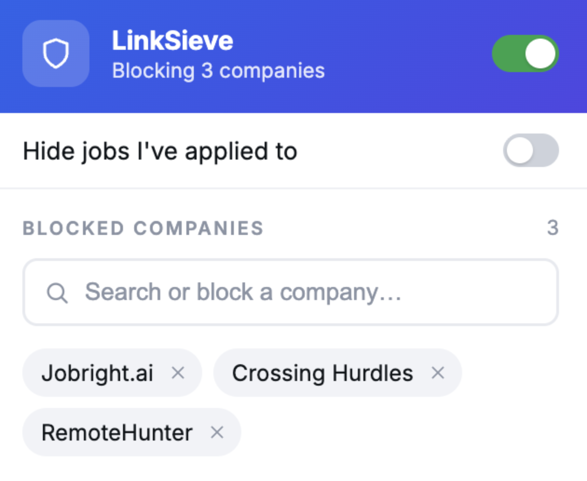

# LinkSeive

Tired of your jobs feed being 60% staffing agencies, AI-generated ghost postings, and the same "We're hiring from a random AI generated Job Board?

Cut through the slop, block the noise, and see the postings that actually matter

Simple-Free-OpenSource Chrome Extension to filter out Linkedin Job Posts




## Features

- **Block companies** — add any company name to a blocklist; matching job cards are hidden instantly
- **Hide applied jobs** — toggle to remove jobs LinkedIn already marks as "Applied"
- **Live search** — type in the popup to filter your blocklist; partial matches are highlighted
- **Undo** — accidentally removed a company? One-click undo brings it back
- **Pause filtering** — disable the extension without losing your blocklist; toolbar icon turns gray so you always know the state
- **Persistent** — settings sync across Chrome profiles via `chrome.storage.sync`

---

## Install via Developer Mode (no Chrome Web Store required)

> These steps work on any Chromium-based browser (Chrome, Edge, Brave, Arc).

**1. Download the code**

Clone the repo or download it as a ZIP and unzip it somewhere on your machine.

```bash
git clone https://github.com/your-username/linkedin-filter-tools.git
```

**2. Open the Extensions page**

Go to `chrome://extensions` in your browser's address bar.

**3. Enable Developer Mode**

Toggle the **Developer mode** switch in the top-right corner of the Extensions page.

**4. Load the extension**

Click **Load unpacked**, then select the folder that contains `manifest.json`
(the root of this repo — `linkedin-filter-tools/`).

**5. Done**

The LinkSieve icon () will appear in your toolbar. Pin it for easy access via the puzzle-piece menu.


## Usage

1. Go to [linkedin.com/jobs](https://www.linkedin.com/jobs/)
2. Click the **LS** toolbar icon to open the popup
3. Type a company name and press **Enter** (or click the Block button) to hide it
4. Toggle **Hide jobs I've applied to** to remove already-applied listings
5. Use the master toggle (top-right of the popup) to pause all filtering at once

---

## How it works

The extension uses a content script (`content.js`) to read through LinkedIn Jobs pages. It uses a **filter registry** — an array of pluggable filter objects — so each filter is self-contained and new filters can be added without touching the core loop.

A background service worker (`background.js`) watches for the enabled/disabled toggle and swaps the toolbar icon between blue (active) and gray (paused).

No data ever leaves your browser — everything is stored locally via `chrome.storage.sync`.

---

## Project structure

```
linkedin-filter-tools/
├── manifest.json       # Extension manifest (MV3)
├── content.js          # Content script — filter logic
├── background.js       # Service worker — manages toolbar icon state
├── popup.html          # Popup markup
├── popup.css           # Popup styles
├── popup.js            # Popup UI logic
└── icons/
    ├── icon16.png      # Active icon (blue)
    ├── icon48.png
    ├── icon128.png
    ├── icon16_paused.png   # Paused icon (gray)
    ├── icon48_paused.png
    └── icon128_paused.png
```
